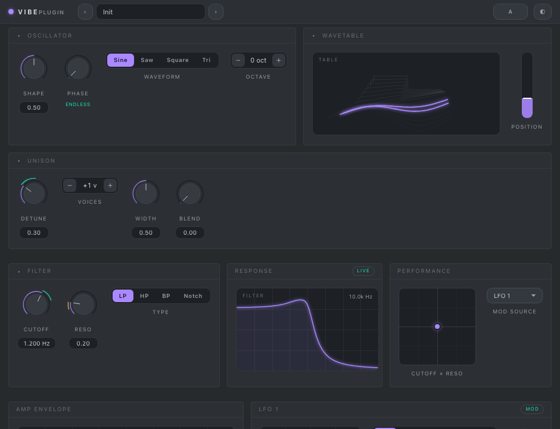
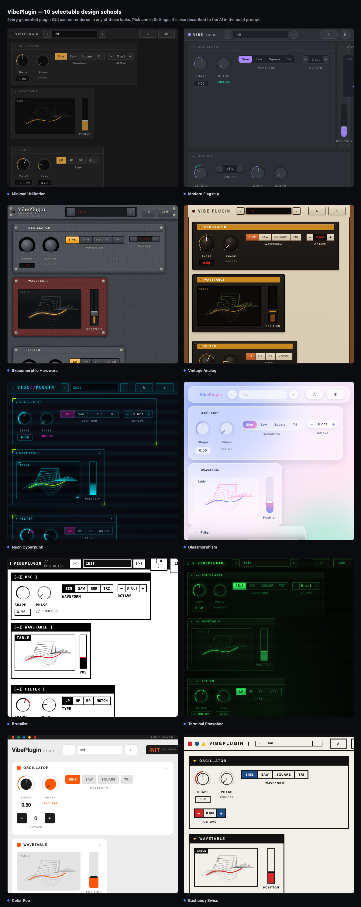

# VibePlugin

Two VST3 plugins — an **effect** (`VibePlugin FX`) and an **instrument/synth**
(`VibePlugin Synth`) — whose DSP and GUI are **written by Claude at runtime**. You
type a prompt ("a warm tape saturator with drive and tone"), Claude generates an
**AssemblyScript** DSP module and an **HTML** GUI, the AssemblyScript is compiled
to **WebAssembly** by a compiler that **ships inside the plugin**, the WASM runs
under **wasmtime**, and the HTML is shown in an embedded WebView. Each plugin
saves to a portable **`.vstai`** file and reloads later — and you can keep
talking to it to evolve it.



### 10 built-in design schools

Every generated GUI is built from a house-style component kit that ships in **ten
distinct visual languages**. Pick one in **Settings** — it becomes the live house
style *and* is described to Claude in the build prompt, so generated plugins follow
the look. You can also export a design and import your own.



```
        ┌──────────────────────────── VibePlugin (C++ / JUCE) ────────────────────────────┐
prompt ▶│  Editor (WebView GUI + prompt bar)                                            │
        │     │ window.vstai.setParam / noteOn / noteOff                                │
        │     ▼                                                                         │
        │  AudioProcessor ──▶ WasmEngine (wasmtime) ◀── plugin.wasm (the DSP)            │
        │     │                                                                         │
        │     ├─ LlmClient ─── HTTPS ──▶ Claude / GLM / local Ollama (open models)      │
        │     │       │ { assembly, html, params }  (structured / JSON output)         │
        │     │       ▼                                                                 │
        │     └─ AssemblyScriptCompiler ──▶ execs bundled vstai-asc ──▶ plugin.wasm     │
        │             (direct exec, no shell; compile errors fed back to the model ≤3×) │
        └───────────────────────────────────────────────────────────────────────────────┘
```

## How AssemblyScript gets compiled (no toolchain on the user's machine)

`asc` (the AssemblyScript compiler) is JavaScript, and its optimizer backend
**Binaryen is a WASM module that needs a real `WebAssembly` engine**. A JS engine
compiled to WASM (QuickJS/Javy) has none, so `asc` can't run inside wasmtime
(verified: it aborts with *"no native wasm support detected"*). So the compiler
ships as a **self-contained JS runtime (V8) with `asc` baked in** — one file
`vstai-asc` (via `deno`/`bun --compile`), or `vstai-node` + `asc-bundle.mjs`. The
plugin **execs it directly** (JUCE `ChildProcess`, no shell) — AssemblyScript file
in, compiled WASM out — and feeds any compile error back to Claude (≤3×). Build it
once with [`compiler/build.sh`](compiler/build.sh); see [compiler/README.md](compiler/README.md).

The generated DSP still runs under **wasmtime**. The only network use is
generating a *new* plugin; a saved `.vstai` runs with no network.

## Compiled-in config (API key baked into the binary)

Copy [`src/Config.example.h`](src/Config.example.h) → `src/Config.h` (gitignored)
and fill in your key:

```cpp
#define VSTAI_CONFIG_API_KEY  "sk-ant-..."
#define VSTAI_CONFIG_MODEL    ""            // empty -> claude-opus-4-8
#define VSTAI_CONFIG_COMPILER ""            // empty -> found next to the plugin
```

It's compiled into the plugin, so no environment is needed at runtime. Any empty
value falls back to the env var (`ANTHROPIC_API_KEY` / `VSTAI_MODEL` /
`VSTAI_COMPILER`). You can also enter keys at runtime — see *Providers* below. ⚠️ The key is embedded in clear text (extractable with
`strings`) — only ship a scoped key you're comfortable distributing.

## Generation (Manual / Claude / GLM / Ollama)

The **Model** dropdown picks who writes the plugin:

| Option | Models | Key | How |
|---|---|---|---|
| **Manual** (free) | any chatbot you have | **none** | copy the prompt → paste into ChatGPT/Claude/etc → paste the reply back |
| **Anthropic** | Opus 4.8, Sonnet 4.6 | your key | `api.anthropic.com/v1/messages` (structured outputs + thinking) |
| **GLM** (Z.ai) | `glm-5.2`, `glm-4.6` | your key | `<glm-url>/chat/completions` (OpenAI-compatible, JSON mode; defaults to Z.ai) |
| **Ollama** | whatever you've pulled locally | **none** | `<ollama-url>/v1/chat/completions` (local, private) |

**Manual ("bring your own chatbot")** is the free, no-API-key, no-account path.
Pick *Copy prompt → paste from any chatbot*, press **Generate**, and a dialog
copies a self-contained prompt to your clipboard. Paste it into any chatbot,
paste the full reply back, and click **Apply** — the plugin extracts the fenced
`assemblyscript` / `html` / `json` blocks and compiles them. This prompt is
deliberately **different** from the API prompt: there's no JSON output schema to
enforce, so it asks for clearly fenced blocks instead. If the DSP doesn't
compile, the dialog shows the error and a **Copy fix request** button — paste
that back to the same chat, paste the new reply, and try again. See
[`Prompt.h`](src/Prompt.h) (`buildManualPrompt` / `parseManualReply`).

Click **Keys…** to enter your Anthropic and GLM keys and the Ollama URL.
These are stored in your user settings
(`~/Library/Application Support/VibePlugin/VibePlugin.settings`) and take precedence
over `Config.h` / env. Leaving a field blank falls back to the compiled-in /
environment value (`ANTHROPIC_API_KEY` / `GLM_API_KEY` /
`VSTAI_OLLAMA_URL` / `OLLAMA_HOST`).

**Ollama** runs open models on your machine with no API key and no network. Start
it (`ollama serve`), pull a model (`ollama pull qwen2.5-coder`), and the plugin
lists your local models under *Ollama (local)* in the dropdown — refreshed
whenever the editor opens or you save the Keys… dialog. Smaller local models are
faster/cheaper but less reliable at one-shot DSP + GUI than Claude; the ≤3×
compile-error retry loop applies to every API provider. "Thinking" depth applies
to Claude models.

## Shareware & lifetime license

VibePlugin is **shareware**: every feature works unlicensed, but a friendly (joking)
warning greets you on open until you buy a one-time **lifetime license**. Click
**License…**, enter the email you bought with and your `VSTAI-…` key, and
**Activate** — the warning disappears. A license works on up to **5 machines**;
activating a 6th automatically releases the oldest. Keys are delivered by email
on purchase (Lemon Squeezy → Scaleway email). The license only removes the nag;
it gates no functionality. The license/credits server is **not part of this
repository** — it lives in a separate private repo (`VibePlugin-server`,
TypeScript + Fastify + Postgres). Point the plugin at your own deployment with
`VSTAI_LICENSE_URL` / `VSTAI_CONFIG_LICENSE_URL` and set `VSTAI_CHECKOUT_URL` to
your checkout link. The plugin is fully usable without it — bring your own API
key or use the manual chatbot path.

## Effect vs. instrument

One core, two products (set by `VSTAI_IS_SYNTH` at build time):

| | `VibePlugin FX` | `VibePlugin Synth` |
|---|---|---|
| Type | audio effect | instrument (`IS_SYNTH`) |
| Buses | stereo in + out | stereo out, MIDI in |
| DSP ABI | reads input, writes output | `noteOn(id, freq, vel)` / `noteOff(id)` + writes output |
| Notes | — | host converts MIDI note→Hz; GUI keyboard via `window.vstai.noteOn/noteOff` |

## The `.vstai` file

Plain JSON, saveable anywhere and reloadable; the same JSON is the DAW session
state, so reopening a project restores the exact plugin:

```jsonc
{
  "format": 1, "name": "Tape Saturator", "isInstrument": false,
  "promptHistory": ["a warm tape saturator…", "add wow & flutter"],
  "assembly": "…AssemblyScript source…",
  "html": "…GUI document…",
  "wasmBase64": "AGFzbQ…",          // the compiled WASM, base64
  "params": [{ "name": "Drive", "index": 0, "min": 0, "max": 1, "default": 0.3, "value": 0.5 }],
  "explanation": "…"
}
```

"Talking again" sends `assembly` + `html` back to Claude with the new prompt, so
it edits in place.

## Editing the code by hand

The plugin window is tabbed:

- **GUI** — the live plugin (the generated WebView).
- **DSP (AssemblyScript)** — a syntax-highlighted editor for the `index.ts` DSP.
- **GUI HTML** — a syntax-highlighted editor for the GUI document.
- **Problems** — compiler output / errors (the in-plugin "debugger").
- **History** — the prompt browser: every version (generate / AI-fix / hand-compile).

Edit either source and **Save & Compile** (or `Cmd/Ctrl+S` in the editor): the
AssemblyScript is recompiled to WASM and, on success, the engine + GUI reload
live. On failure the previous plugin keeps playing and the compiler errors show
up in **Problems**. **Fix with AI** hands the current source (plus any compiler
errors) to the selected model to repair — using the same ≤3× compile-retry loop
as generation. **Revert** restores the last compiled source. Editors use JUCE's
built-in highlighter (offline, no external editor).

The **History** tab is a prompt browser: every successful version (generate,
AI-fix, or hand-compile) is snapshotted onto an append-only timeline. Pick any
entry and **Restore** (or double-click) to load it — engine, GUI, and editors
all roll back. The timeline never truncates, so generating again after stepping
back just branches; a bad generation never costs you earlier work. The last ~25
snapshots are kept in the `.vstai` file and the DAW session.

---

## Build & run

### Quick start — scripts (macOS)

Two scripts build everything and **publish to your local VST3 folder, signed**
so a DAW will load them. They auto-build the bundled compiler and auto-download
the wasmtime c-api on first run.

```bash
./scripts/build.sh     # Release  -> ~/Library/Audio/Plug-Ins/VST3, code-signed
./scripts/dev.sh       # Debug + file logging (development mode), same place
./scripts/dev.sh --tail  # follow the dev log
```

Then in **FL Studio**: *Options ▸ Manage plugins ▸ Find plugins* to rescan, and
the plugins appear as **VibePlugin FX** (effect) and **VibePlugin Synth** (instrument).
(There's also a Standalone `.app` under `build*/…/Standalone/` for quick testing
without a DAW.)

Signing identity: the scripts auto-pick the first code-signing identity in your
keychain (else ad-hoc, local-only). Override with
`VSTAI_SIGN_ID="Developer ID Application: …" ./scripts/build.sh`. See
[Signing](#signing--gatekeeper-macos) for the one-time keychain setup.

### Development mode

`scripts/dev.sh` builds with `-DVSTAI_DEV_MODE=ON`, which turns on a file logger
(`src/DevLog.h`) tracing the whole generate → compile → load pipeline (the prompt,
the Claude HTTP status, the exact compiler command, compile diagnostics, wasm
size). In a DAW you can't see stdout, so it writes to:

```
~/Library/Logs/VibePlugin/VibePlugin FX.log
~/Library/Logs/VibePlugin/VibePlugin Synth.log
```

`VSTAI_LOG(...)` compiles to nothing in release builds. Dev and release use
separate build dirs (`build-dev` / `build`); installing one replaces the other
in the VST3 folder, so rescan after switching.

### Testing the knobs (no DAW)

`scripts/test.sh` drives the real `WasmEngine` headlessly to verify the
knob/note path that runs between the GUI and the DSP:

```bash
./scripts/test.sh                 # regression tests: protocol + reference effect/synth
./scripts/test.sh MyPlugin.vstai  # sweep every param of a saved plugin
```

The reference run asserts the bridge URL protocol parses, and that the gain,
cutoff, and synth-level knobs actually change the audio. The `.vstai` run sweeps
each parameter min→max and reports `OK affects audio` / `DEAD does nothing` /
`?? no audio`, so before shipping a generated plugin you can **Save** it and
confirm every knob is wired (a `DEAD` knob is one to ask the AI to fix). It exits
non-zero if any knob is dead, so it also works as a CI gate. The GUI↔host wire
format lives in one header, `src/BridgeProtocol.h`, used by both the plugin and
the test.

### Signing / Gatekeeper (macOS)

On Apple Silicon a plugin must be code-signed to load. The scripts sign for you;
the one-time setup is just getting a valid signing identity:

- An **Apple Development** cert (Xcode ▸ Settings ▸ Accounts ▸ Manage
  Certificates) is enough for local use. Verify with
  `security find-identity -v -p codesigning` (must show ≥ 1 identity).
- If signing fails with *"unable to build chain to self-signed root"*, your
  keychain is missing Apple's CA certs — import the current **WWDR G3**
  intermediate and **Apple Root CA** from <https://www.apple.com/certificateauthority/>.
- Signing uses **no hardened runtime**: the DSP (wasmtime) and the bundled
  compiler (V8) both JIT, which hardened runtime blocks without extra
  entitlements. Distributing to *other* Macs needs a **Developer ID Application**
  cert + notarization (add `--options runtime` + the JIT entitlements first).

### Manual build

### 1. Build the bundled compiler once (dev-time; needs Node 18+ to build)

```bash
cd compiler && ./build.sh
```

`build.sh` **downloads a portable Node runtime for the system you run it on**
(official single-binary build — your local/Homebrew node is only used to run the
bundler), and bundles `asc` into `asc-bundle.mjs`. Output is `vstai-node` +
`asc-bundle.mjs` (~124 MB), or a single `vstai-asc` if you have `deno`/`bun`
installed. See [compiler/README.md](compiler/README.md).

### 2. Put your Claude key in (compiled into the plugin)

```bash
cp src/Config.example.h src/Config.h   # then edit src/Config.h
```

Set `VSTAI_CONFIG_API_KEY "sk-ant-..."` in `src/Config.h`. It's baked into the
binary, so the plugin needs no environment at runtime. `Config.h` is gitignored.
Leave it empty to use the `ANTHROPIC_API_KEY` env var instead. ⚠️ A compiled-in
key is extractable from the binary with `strings` — use a scoped key you're OK
shipping.

### 3. Build the plugins (CMake + JUCE 8 + wasmtime)

Download a prebuilt **wasmtime c-api** release for your platform from
<https://github.com/bytecodealliance/wasmtime/releases> (the `…-c-api` asset),
extract it, then:

```bash
cmake -B build -DWASMTIME_DIR=/path/to/wasmtime-vXX.X.X-<platform>-c-api
cmake --build build --config Release
```

JUCE is fetched automatically. Both products build (VST3 + Standalone). Ship the
compiler from step 1 next to the plugin (or point `VSTAI_CONFIG_COMPILER` /
`$VSTAI_COMPILER` at it). (On Linux, HTTPS links libcurl automatically.)

### 4. Use it

Type a prompt, press **Generate**. Tweak with the generated controls; the synth's
GUI keyboard plays via `window.vstai.noteOn/noteOff`. **Save** to a `.vstai`
anywhere; **Load** to bring one back; or send another prompt to evolve it.

---

## Layout

```
src/                         C++ (shared by both plugins)
  WasmAbi.h                  the host<->WASM contract (source of truth)
  Prompt.h                   system prompt + output schema  ← "the prompt"
  Config.example.h           copy to Config.h to bake in the API key
  Settings.h                 resolves config (compiled-in or env)
  AppSettings.h              runtime keys/URL + license via Keys…/License…
  LlmClient.*                raw HTTPS to Claude / GLM / Ollama
  ManualPanel.h              "bring your own chatbot" dialog (copy prompt / paste reply)
  LicenseClient.h            license server HTTP (activate / validate / deactivate)
  LicensePanel.h             "License…" dialog: activate a lifetime key
server/                      lives in a separate PRIVATE repo: VibePlugin-server (not in this tree)
  AssemblyScriptCompiler.*   execs the bundled compiler -> WASM
  WasmEngine.*               wasmtime wrapper; audio + synth notes
  VstaiDocument.*            the .vstai JSON model (+ DAW state)
  PluginProcessor.*          audio/MIDI + state + generate/compile loop
  PluginEditor.*             prompt bar + tabs (GUI/DSP/HTML/Problems/History) + bridge
  SourceEditor.h             dark CodeEditorComponent for the DSP/HTML tabs
  HistoryPanel.h             prompt browser (revision timeline) for the History tab
compiler/                    builds the bundled AssemblyScript compiler
  asc-driver.mjs             <in.ts> in, <out.wasm> out
  build.sh                   esbuild + (deno/bun/node) -> vstai-asc
wasm-template/assembly/      reference AssemblyScript: index.ts (effect), synth.ts
web/                         the default starter GUI
```

## Notes & limits

- ABI: planar f32, ≤ 8192 frames/block, ≤ 2 channels, ≤ 64 params (see
  `WasmAbi.h`). Generated modules are sandboxed (no imports, no host calls).
- If no module is loaded (or while one swaps in), audio passes through.
- Generated GUIs are offline/self-contained (no CDN/network) — they only talk to
  the host through `window.vstai`.
- The REST calls are non-streaming with a 10-minute timeout; switch
  `LlmClient` to streaming for very large generations. Ollama caps output at ~8k
  tokens; GLM is a reasoning model given a large budget (thinking + output share
  it). Very large GUIs are best generated with Claude or GLM.
- Treat generated code as untrusted: DSP runs in the WASM sandbox, the GUI in an
  embedded WebView. Don't paste secrets into prompts.

## License

VibePlugin (this repository — the plugins, DSP/GUI engine, bundled compiler and
website) is free software under the **GNU Affero General Public License v3.0**
([LICENSE](LICENSE)). You may use, study, modify and redistribute it; if you
distribute a modified version — or run one as a network service — you must make
your complete source available under the same license.

The hosted backend that powers the optional paid tiers (**cloud credits** and the
**lifetime license** — API-key proxying, payments, activation) is **not** covered
by this license and lives in a separate **private** repository
(`VibePlugin-server`). Nothing here depends on it: bring your own API key, or use
the manual chatbot path, and everything works (and runs offline after a plugin is
generated).

**Commercial / dual licensing.** AGPL-3.0 requires derivative and networked works
to be released under the AGPL too. If you want to build on VibePlugin in a
closed-source or commercial product without those obligations, a separate
commercial license is available — contact <k@1ln.de>.
