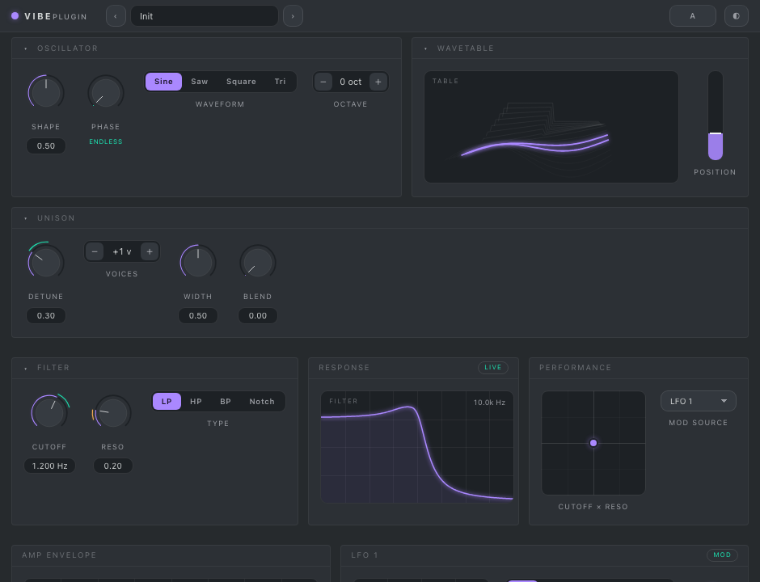
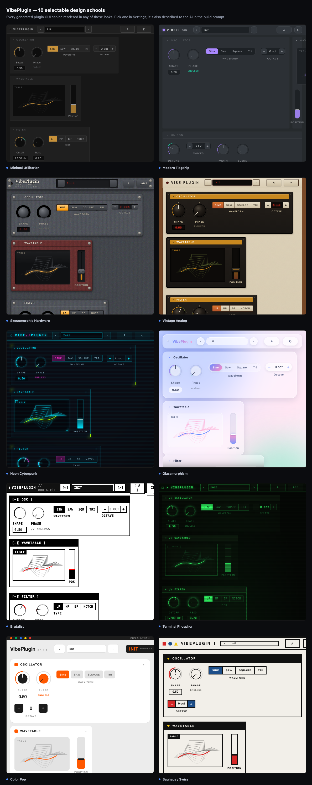

# VibePlugin

**Describe an audio plugin in a sentence. Get a working one back.**

VibePlugin is two VST3 plugins for your DAW — an effect (**VibePlugin FX**) and a
synth (**VibePlugin Synth**) — that have no fixed sound of their own. You type a
prompt like *“a warm tape saturator with drive and tone”*, and Claude writes the
audio code **and** the interface on the spot. A few seconds later you have a real
plugin with real knobs, playing in your project. Don’t like it? Tell it what to
change and it rewrites itself.

Every plugin you make saves to a small `.vstai` file you can reopen, share, or
turn into a standalone plugin to hand to someone else. Once a plugin is made, it
runs entirely offline.

- **Website & downloads:** <https://k1ln.github.io/VibePlugin/>
- **All releases:** <https://github.com/k1ln/VibePlugin/releases>
- **Try creations in your browser first:** the [gallery](https://k1ln.github.io/VibePlugin/gallery/) plays shared plugins live

---

## Install

VibePlugin is a **VST3 plugin**. It loads in any DAW that supports VST3 (FL
Studio, Ableton Live, Reaper, Bitwig, Studio One, Cubase, and others).

### 1. Download

Grab the build for your system from the
[Downloads page](https://k1ln.github.io/VibePlugin/releases.html) or straight
from [GitHub Releases](https://github.com/k1ln/VibePlugin/releases/latest):

| System | File | Notes |
|---|---|---|
| **macOS** | `VibePlugin-<version>-macos.zip` | Apple Silicon & Intel |
| **Windows** | `VibePlugin-<version>-windows.zip` | Windows 10 / 11, 64-bit |
| **Linux** | `VibePlugin-<version>-linux.zip` | x86-64 |

### 2. Unzip and copy the `.vst3` bundles into your VST3 folder

| System | Folder |
|---|---|
| macOS | `~/Library/Audio/Plug-Ins/VST3` |
| Windows | `C:\Program Files\Common Files\VST3` |
| Linux | `~/.vst3` |

### 3. Rescan plugins in your DAW

They show up as **VibePlugin FX** (effect) and **VibePlugin Synth** (instrument).
In FL Studio: *Options ▸ Manage plugins ▸ Find plugins*.

> **macOS:** if the Mac refuses to load it (“can’t be opened / unidentified
> developer”), right-click the `.vst3` ▸ **Open**, or run once in Terminal:
> `xattr -dr com.apple.quarantine "VibePlugin FX.vst3"`

---

## Make your first plugin

1. Add **VibePlugin FX** to an audio track (or **VibePlugin Synth** to an
   instrument track).
2. Open its window. Type a prompt in the bar at the top — e.g.
   *“punchy drum bus compressor with attack, release and mix”*.
3. Press **Generate**. It writes the code, compiles it, and loads it live —
   usually a few seconds.
4. Play your track. Turn the knobs it made you.
5. **Save** to a `.vstai` file anywhere on disk so you can reopen it later.

### Keep talking to it

The prompt bar doesn’t go away. Send another line — *“add wow and flutter”*,
*“make the tone control darker”*, *“give it a VU meter”* — and it edits the
plugin you already have instead of starting over. The **History** tab keeps every
version, so you can always step back.

---

## What it costs

VibePlugin itself is **free and open source** — nothing to buy, no license key,
no trial. What can cost money is the AI that writes the plugins, and even that is
optional. You pick how you generate from the **Model** dropdown.

**Use whichever of these suits you — in this order:**

1. **Already have an Anthropic API key?** Paste it into **Settings** and you're
   done. Generations go straight to Anthropic and you pay them directly for what
   you use — nothing passes through us.
2. **Don't have a key, or just trying it out?** Use **Bring your own chatbot**
   first. It's completely free: the plugin copies a prompt to your clipboard, you
   paste it into any AI chat you already use (ChatGPT, Claude, Gemini…), paste
   the reply back, and it builds. Every feature works this way.
3. **Don't want a key and don't want to copy-paste?** Then — and only then —
   buy **VibePlugin Cloud** credits from us. It's pay-as-you-go, no subscription,
   no API key to manage; we run the request on our key and bill you for the
   usage. This is the option that opens a payment page.

| Option | What you need | Cost |
|---|---|---|
| **Your own Anthropic API key** | A key from [console.anthropic.com](https://console.anthropic.com) | You pay Anthropic directly for what you use. Nothing goes through us. |
| **Bring your own chatbot** *(Manual)* | Any AI chat you already use | **Free.** Copy the prompt out, paste the reply back. |
| **VibePlugin Cloud** | A free account — click **Account**, sign in | **Pay-as-you-go credits, bought from us.** No key to manage. The convenience option. |

### How VibePlugin Cloud pricing works

It is **not a subscription** and **not a flat fee per prompt**. You buy a balance
of credits up front, and each generation costs a small amount based on how much
work the AI actually did (how long the code and interface are, how much the model
had to think).

- **1 credit = $0.01.** Packs are bought through our payments provider (Polar) —
  that’s the “pay website” you saw.
- A typical full plugin costs **roughly $0.15–$0.40** (about 15–40 credits) on
  the standard model. Small tweaks cost less. The most powerful model costs a few
  times more; the cheapest model roughly half.
- After every generation the plugin shows you exactly what it charged and your
  remaining balance — you’re never guessing.
- Run out and generation simply pauses until you top up. Plugins you’ve already
  made keep working.

**Don't want to pay us anything?** You never have to. Use your own Anthropic key,
or the *Bring your own chatbot* path — both have every feature. Cloud credits
only exist as a convenience for people who want neither.

---

## 10 built-in design styles

Every interface VibePlugin generates is built from a house component kit that
comes in **ten visual styles** — minimal, vintage analog, brutalist, neon,
glassmorphism, and more. Pick one in **Settings**; it becomes the live look and
is also described to the AI so new plugins match it. You can export a style and
import your own.

---

## Save, reopen, and share

- **`.vstai` file** — every creation saves to a small portable file. Anyone
  running VibePlugin can **Load** it. Your DAW project also stores it, so
  reopening a session brings the exact plugin back.
- **Publish to the gallery** — the **Publish** button uploads your creation to
  the [web gallery](https://k1ln.github.io/VibePlugin/gallery/), where it plays
  live in the browser and others can download it.
- **Export as a standalone plugin** — **Export plugin…** turns the loaded
  creation into its own locked `.vst3` with its own name. It opens straight to
  the finished interface with no prompt bar and no editor, so you can give a
  finished instrument to someone who doesn’t care how it was made. On macOS,
  add a notarization profile in **Settings** and it’ll be ready to run on any
  Mac with no warnings.

---

## Editing by hand (optional)

You don’t have to touch code, but you can. The plugin window has tabs for the
**DSP** source and the **interface** source in a full editor. Change either and
press **Save & Compile** — it rebuilds and reloads live, and if it doesn’t
compile, your current sound keeps playing while the errors show up. **Fix with
AI** hands the errors back to the model to repair.

---

## Troubleshooting

**The interface didn’t appear — it said “juce.backend couldn’t be reached”, but
sound worked and I could see the code.**
This was a limitation of the embedded browser on **older operating systems**
(notably macOS before version 12), which refuses to load the live-interface panel.
As of the current release the plugin detects this and renders the interface a
different way automatically, so it should just work. If you still see it on an
up-to-date VibePlugin, please
[open an issue](https://github.com/k1ln/VibePlugin/issues) with your OS and DAW —
and in the meantime the plugin is still usable: the sound runs and you can view
and edit the interface in the **GUI HTML** tab.

**Trying to generate opened a payment website.**
You had **VibePlugin Cloud** selected in the Model dropdown, which is the
pay-as-you-go option. Switch to **Bring your own chatbot** (free) or enter your
own Anthropic API key in Settings — see [What it costs](#what-it-costs).

**The plugin doesn’t show up in my DAW.**
Confirm the `.vst3` is in the correct folder (above) and rescan. On macOS, clear
the quarantine flag (above). Some DAWs cache plugin scans — force a full rescan.

**Does it need internet?**
Only to *generate or edit* a plugin. A saved `.vstai` runs fully offline, and so
does every exported standalone plugin.

**Where do my creations go?**
Wherever you **Save** the `.vstai` file. The plugin keeps no hidden library; the
file and your DAW session are the only copies.

---

## Building from source & how it works

VibePlugin is open source. The compiler that turns AI-written code into a running
plugin **ships inside the plugin** — there’s no toolchain to install on the
user’s machine. If you want to build it yourself, understand the architecture, or
contribute, see **[docs/DEVELOPING.md](docs/DEVELOPING.md)**.

The paid **VibePlugin Cloud** tier is powered by a small separate server
(`VibePlugin-server`, a private repo). Nothing in this repository depends on it —
the plugin is fully usable with your own key or the free chatbot path.

---

## License

VibePlugin is free software under the **GNU Affero General Public License v3.0**
([LICENSE](LICENSE)). You may use, study, modify, and redistribute it; if you
distribute a modified version — or run one as a network service — you must make
your complete source available under the same license.

The hosted backend for the optional paid tier (cloud credits — API-key proxying
and payments) is **not** covered by this license and lives in a separate private
repository.

**Commercial / dual licensing.** If you want to build on VibePlugin in a
closed-source or commercial product without the AGPL’s obligations, a separate
commercial license is available — contact <k@1ln.de>.
